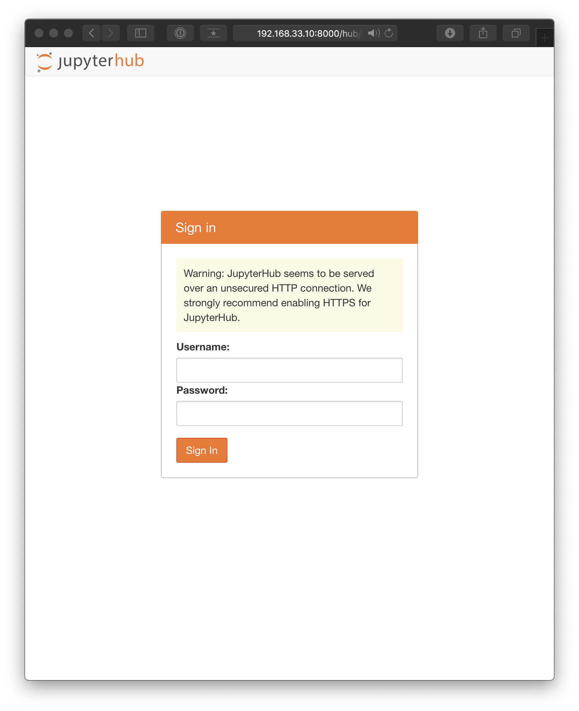
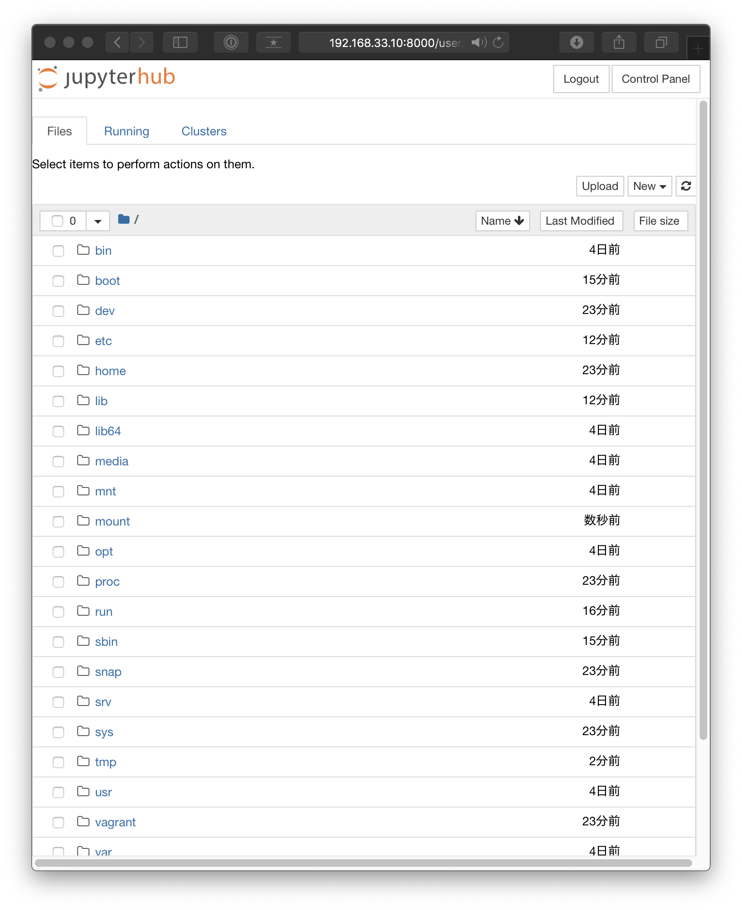
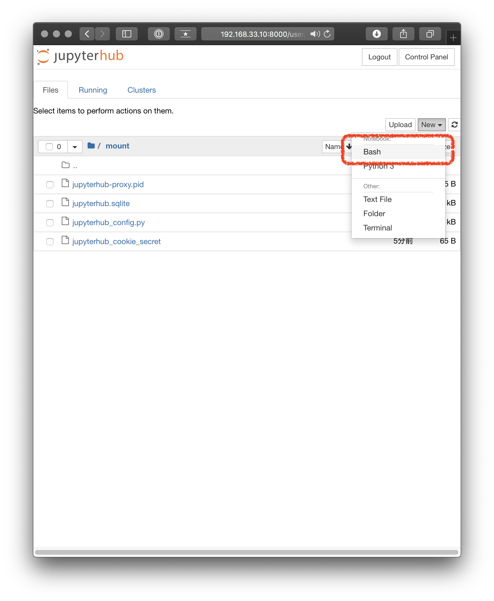
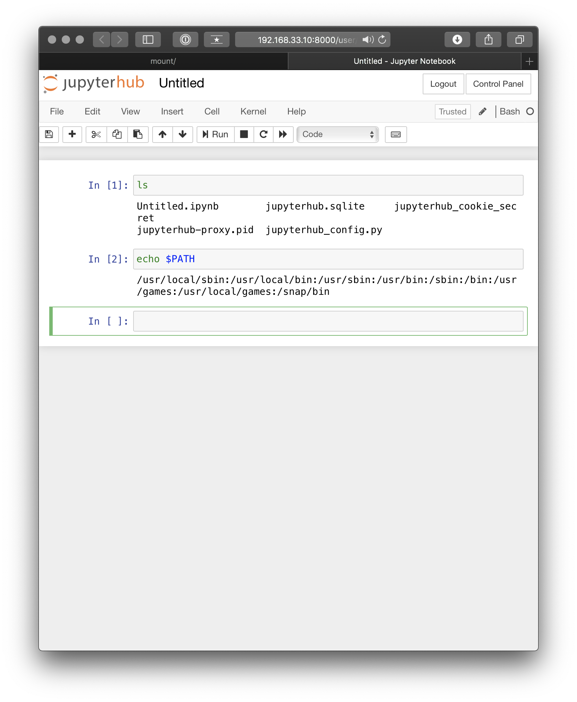

# JupyterHub + Bash Kernel 環境

- JupyterHub はマルチユーザ用の JupyterNotebook 環境
  - PAM 認証を使ってそれぞれのユーザがサーバ上で JupyterNotebook を使えるようになる
    - それぞれのユーザの `PATH` などが Notebook 上に引き継がれる
    - ファイルの作成などもユーザの Permission で行われる
- マルチユーザ環境が必要がない場合は JupyterNotebook を導入すれば良い
- Vagrant を用いて、Ubuntu 18.04 環境を作成し、導入する
  - Host にそのままインストールする場合は、Vagrant の項を飛ばす

## 検証環境

- OS
  - `macOS Catalina ver 10.15.2`
- Vagrant
  - `2.2.7`
- Virtual Box
  - `6.1.2r135662`
- Ubuntu
  - `18.04.3 LTS`

```bash
$ sw_vers
ProductName:	Mac OS X
ProductVersion:	10.15.2
BuildVersion:	19C57
$ vagrant -v
Vagrant 2.2.7
$ VBoxManage -v
6.1.2r135662
```

## Vagrant

- 検証環境と実行環境のズレを無くすために、検証環境として Ubuntu 18.04 環境を作成する

```bash
$ ls
Vagrantfile
$ cat Vagrantfile
Vagrant.configure("2") do |config|
  config.vm.box = "ubuntu/bionic64"
  config.vm.network "private_network", ip: "192.168.33.10"
  config.vm.synced_folder "./mount", "/mount"
  config.vm.provider "virtualbox" do |vb|
    vb.memory = "4096"
  end
end
$ mkdir mount
$ vagrant up
$ vagrant ssh
Welcome to Ubuntu 18.04.3 LTS (GNU/Linux 4.15.0-76-generic x86_64)

 * Documentation:  https://help.ubuntu.com
 * Management:     https://landscape.canonical.com
 * Support:        https://ubuntu.com/advantage

  System information as of Mon Feb  3 10:16:18 UTC 2020

  System load:  0.19              Processes:             98
  Usage of /:   10.0% of 9.63GB   Users logged in:       0
  Memory usage: 3%                IP address for enp0s3: 10.0.2.15
  Swap usage:   0%                IP address for enp0s8: 192.168.33.10


0 packages can be updated.
0 updates are security updates.
$ sudo apt update && sudo apt upgrade -y
```

## JupyterHUb

- 以下、Ubuntu Server 18.04 LST がインストールされた直後の状態とする

まず Python 環境の確認

```bash
$ which python3
/usr/bin/python3
$ which pip3
$ python3 -V
Python 3.6.9
```

Nodejs 環境と pip 環境を install する

```bash
$ sudo apt install -y \
    nodejs \
    npm \
    python3-pip
```

JupyterHub 本体と依存する npm library を install する

```bash
$ sudo pip3 install jupyterhub notebook
$ sudo npm install -g configurable-http-proxy
```

Bash Kernel を install する

```bash
$ pip3 install bash_kernel
$ python3 -m bash_kernel.install
Installing IPython kernel spec
```

JupyterHub の設定 file を作成し、起動する

```bash
$ cd /mount  # Vagrantfile 内で host に mount されるように設定されている
$ jupyterhub --generate-config
Writing default config to: jupyterhub_config.py
$ ls
jupyterhub_config.py
```

好きな editor で `jupyterhub_config.py` を編集する。
多くの設定があるが、ここでは JupyterHub 起動時 DirTree の Root を設定しておく。
default 設定では、それぞれのユーザの home dir 以下である。

```python
c.Spawner.notebook_dir = "/"
c.Spawner.default_url = "/tree"
```

起動し、Host の browser からアクセスする

```bash
$ pwd
/mount
$ jupyterhub
[I 2020-02-03 12:50:42.113 JupyterHub app:2240] Running JupyterHub version 1.1.0
[I 2020-02-03 12:50:42.114 JupyterHub app:2271] Using Authenticator: jupyterhub.auth.PAMAuthenticator-1.1.0
[I 2020-02-03 12:50:42.114 JupyterHub app:2271] Using Spawner: jupyterhub.spawner.LocalProcessSpawner-1.1.0
[I 2020-02-03 12:50:42.114 JupyterHub app:2271] Using Proxy: jupyterhub.proxy.ConfigurableHTTPProxy-1.1.0
[I 2020-02-03 12:50:42.116 JupyterHub app:1349] Loading cookie_secret from /mount/jupyterhub_cookie_secret
[I 2020-02-03 12:50:42.153 JupyterHub proxy:461] Generating new CONFIGPROXY_AUTH_TOKEN
[W 2020-02-03 12:50:42.154 JupyterHub app:1624] No admin users, admin interface will be unavailable.
[W 2020-02-03 12:50:42.154 JupyterHub app:1626] Add any administrative users to `c.Authenticator.admin_users` in config.
[I 2020-02-03 12:50:42.154 JupyterHub app:1655] Not using whitelist. Any authenticated user will be allowed.
10
[I 2020-02-03 12:50:42.216 JupyterHub app:2311] Initialized 0 spawners in 0.007 seconds
[W 2020-02-03 12:50:42.222 JupyterHub proxy:643] Running JupyterHub without SSL.  I hope there is SSL termination happening somewhere else...
[I 2020-02-03 12:50:42.222 JupyterHub proxy:646] Starting proxy @ http://:8000
```

- 下のリンクにアクセスする
  - http://192.168.33.10:8000/hub/login
  - `192.168.33.10` は `Vagrantfile` にて定義した private network
    - 環境によって異なる

---

- ログイン画面
  - それぞれのユーザ名、パスワードを入力する
  - Vagrant 環境の場合は `vagrant:vagrant`



- ファイルツリー画面
  - `/mount` が Host に mount されているため、それをクリックする



- Notebook 起動画面
  - 右上の `[new]` から Bash を選択する



- Notebook 画面
  - 起動後は通常の JupyterNotebook と同様に操作を行う



## JupyterHub の Service 化

- JupyterHub を systemd で自動起動するように設定する

```bash
$ sudo curl -fsSL https://gist.githubusercontent.com/lambdalisue/f01c5a65e81100356379/raw/ecf427429f07a6c2d6c5c42198cc58d4e332b425/jupyterhub -o /etc/init.d/jupyterhub
$ sudo chmod +x /etc/init.d/jupyterhub
# いくつかの設定を書き換える。ここらへんは環境依存
$ sudo sed -i -e "s#PATH=/sbin:/usr/sbin:/bin:/usr/bin:/usr/local/bin#PATH=$(echo $PATH)#g" /etc/init.d/jupyterhub
$ sudo sed -i -e "s#/etc/jupyterhub/jupyterhub_config.py#/mount/jupyterhub_config.py#g" /etc/init.d/jupyterhub
$ sudo sed -i -e "45a cd /mount" /etc/init.d/jupyterhub

$ sudo systemctl daemon-reload
$ sudo update-rc.d jupyterhub defaults
$ sudo systemctl start jupyterhub
$ sudo systemctl status jupyterhub
● jupyterhub.service - LSB: Start jupyterhub
   Loaded: loaded (/etc/init.d/jupyterhub; generated)
   Active: active (running) since Mon 2020-02-03 13:26:18 UTC; 6s ago
     Docs: man:systemd-sysv-generator(8)
  Process: 14624 ExecStart=/etc/init.d/jupyterhub start (code=exited, status=0/SUCCESS)
    Tasks: 10 (limit: 4703)
   CGroup: /system.slice/jupyterhub.service
           ├─14644 /usr/bin/python3 /usr/local/bin/jupyterhub --config=/mount/jupyterhub_config.py
           └─14652 node /usr/local/bin/configurable-http-proxy --ip --port 8000 --api-ip 127.0.0.1 --api-port 8001 --error-target http://127.0.0.1:8081/hub/error

Feb 03 13:26:18 ubuntu-bionic systemd[1]: Starting LSB: Start jupyterhub...
Feb 03 13:26:18 ubuntu-bionic systemd[1]: Started LSB: Start jupyterhub.
```
